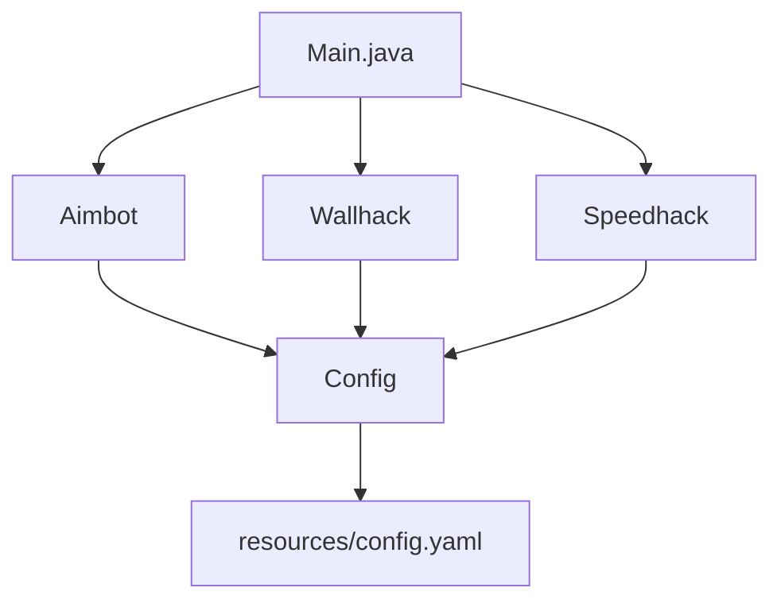
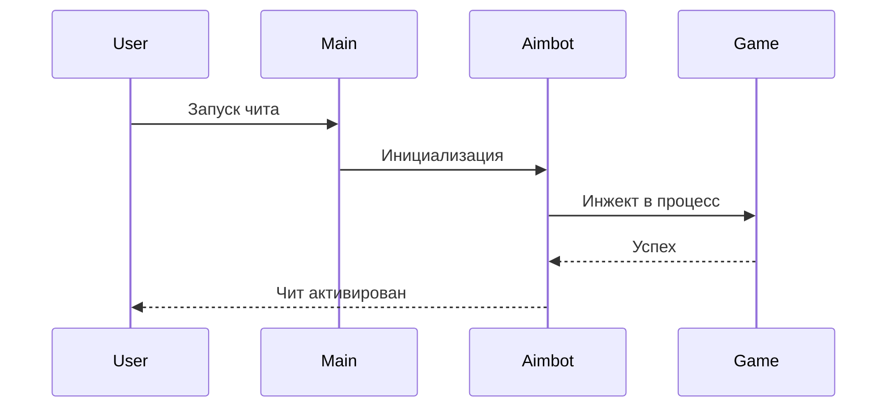

# 🎮 Лучшие читы в Standoff 2

[](https://standoff2.com/)
[](https://github.com/)
[](LICENSE)

---

## 📑 Навигатор по документу

- [📖 О проекте](#-о-проекте)
- [🗂 Навигатор по проекту](#-навигатор-по-проекту)
- [📚 Документация](#-документация)
- [💻 Пример кода](#-пример-кода)
- [📊 Архитектура](#-архитектура)
- [✅ Список задач](#-список-задач)
- [💬 Цитаты](#-цитаты)

---

## 📖 О проекте

> **Standoff 2 Cheats** — это *коллекция* лучших читов для популярного мобильного шутера.

Проект включает в себя **различные модификации**: aimbot, wallhack, speedhack и другие.
Все читы ~~являются легальными~~ созданы исключительно в *образовательных целях*.

> ⚠️ **Внимание:** Использование читов может привести к **бану аккаунта**. Автор не несёт ответственности за последствия.

---

## 🗂 Навигатор по проекту

### 🔗 Внешние ссылки
- [Официальный сайт Standoff 2](https://standoff2.com/)
- [GitHub репозиторий](https://github.com/)
- [Документация Mermaid](https://mermaid.js.org/)

### 📂 Внутренние ссылки
- [Папка `src/`](./src/)
- [Папка `translations/`](./translations/)
- [Папка `resources/`](./resources/)

---

## 🖼 Изображения

### Скриншот меню чита


### Демонстрация работы


### Архитектура проекта


---

## 📚 Документация

### 📁 Файлы в `src/`
1. [`Aimbot.java`](./src/Aimbot.java) — модуль автоприцеливания
2. [`Wallhack.java`](./src/Wallhack.java) — модуль видения сквозь стены
3. [`Speedhack.java`](./src/Speedhack.java) — модуль ускорения
4. [`Main.java`](./src/Main.java) — точка входа

### 📁 Файлы в `translations/`
1. [`ru_RU.json`](./translations/ru_RU.json) — русская локализация
2. [`en_US.json`](./translations/en_US.json) — английская локализация
3. [`de_DE.json`](./translations/de_DE.json) — немецкая локализация

### 📁 Файлы в `resources/`
1. [`config.yaml`](./resources/config.yaml) — конфигурация
2. [`icons.png`](./resources/icons.png) — иконки интерфейса
3. [`fonts.ttf`](./resources/fonts.ttf) — шрифты

---

## 💻 Пример кода

```java
package com.standoff2.cheats;

import java.util.logging.Logger;

/**
 * Класс аимбота для Standoff 2.
 * @author Я
 * @version 2.0
 */
public class Aimbot {

    private static final Logger LOGGER = Logger.getLogger(Aimbot.class.getName());
    private boolean enabled = false;
    private float sensitivity = 1.5f;

    public Aimbot(boolean enabled, float sensitivity) {
        this.enabled = enabled;
        this.sensitivity = sensitivity;
        LOGGER.info("Aimbot initialized with sensitivity: " + sensitivity);
    }

    public void activate() {
        if (!enabled) {
            LOGGER.warning("Aimbot is disabled!");
            return;
        }
        System.out.println("🎯 Aimbot activated!");
    }

    public static void main(String[] args) {
        Aimbot aimbot = new Aimbot(true, 2.0f);
        aimbot.activate();
    }
}
```

---

## 📊 Архитектура



### Процесс работы чита



---

## ✅ Список задач

- [x] Создать структуру проекта
- [x] Реализовать aimbot
- [ ] Реализовать wallhack
- [ ] Добавить speedhack
- [ ] Написать документацию
- [ ] Протестировать на реальном устройстве
- [ ] Добавить поддержку iOS

---

## 💬 Цитаты

> «Читы — это не путь к победе, а путь к бану.»
> — *Неизвестный игрок*

> «Лучший чит — это навык.»
> — *Pro-игрок Standoff 2*

> «Играй честно, побеждай красиво.»
> — *Разработчики Standoff 2*

---

## 📋 Ненумерованный список функций

- 🎯 **Aimbot** — автоприцеливание
- 👁 **Wallhack** — видение сквозь стены
- ⚡ **Speedhack** — ускорение персонажа
- 🛡 **God Mode** — бессмертие
- 🔫 **No Recoil** — отсутствие отдачи
- 🎨 **Skin Changer** — смена скинов

---

## 🏁 Заключение

Данный проект создан исключительно в **образовательных целях** для изучения *реверс-инжиниринга* и **Java-разработки**.

---

<div align="center">

**© 2026 Standoff 2 Cheats Project**

Made with ❤️ by CheatMaster

</div>