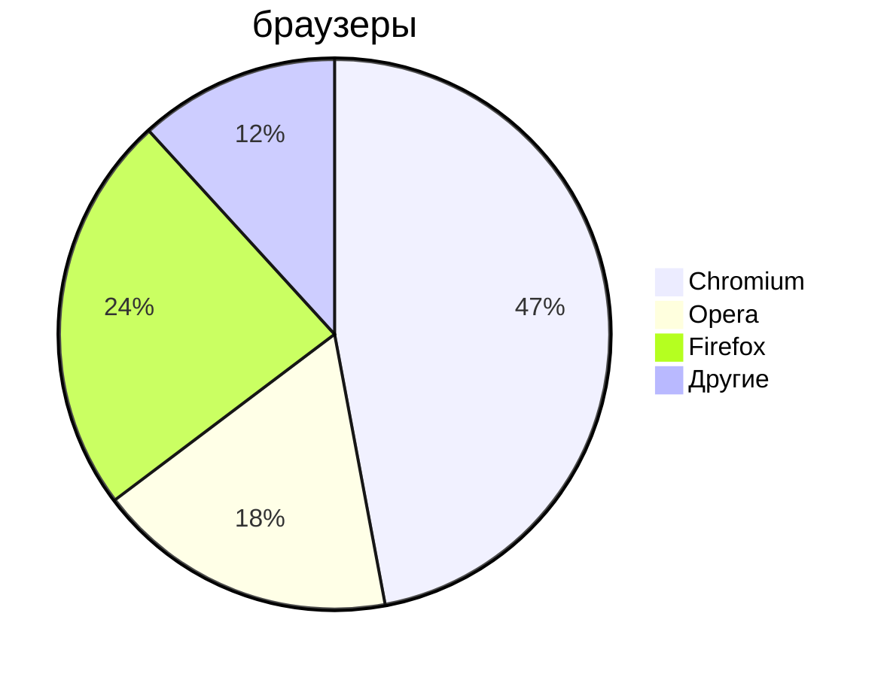

# Markdown

_Markdown_ - простое форматирование документа, пригодное для Git-репозиториев, документаций и заметок.

## Основы редактирования текста

### Курсор

Клавиши

- `Home` - курсор в начало строки
- `End` - курсор в конец строки
- `pgUp` - курсор вверх
- `pgDOWN` - курсор вниз

### Выделение текста

- `Ctrl+A` - выделить весь текст
- `Ctrl+S` - сохранить документ
- `Ctrl+C` - копировать выделенное
- `Ctrl+V` - вставить выделенное
- `Ctrl+<` - выделить символ слева от курсора
- `Ctrl+>` - выделить символ справа от курсора
- `Shift+>` - посимвольное выделение вправо
- `Shift+<` - посимвольное выделение влево
- `Ctrl+Shift+>` - пословное выделение текста вправо
- `Ctrl+Shift+<` - пословное выделение текста влево

### Копирование/вставка

- `Ctrl+Shift+C` - копировать выделенное в терминале
- `Ctrl+Shift+V` - вставить выделенное в терминале

### Редактирование текста

- `Del` - удалить символ справа от курсора
- `Backspace` - удалить символ слева от курсора
- `Ins/Insert` - войти в режим замещения текста справа от курсора
- `Ctrl+>` - перемещение по словам вправо
- `Ctrl+<` - перемещение по словам влево

---

## Markdown

Текст

Заголовки

# - Заголовок 1-го ур-ня

## - Заголовок 2-го ур-ня

### - Заголовок 3-го ур-ня

etc.

- **Жирный текст**
- _Курсив_
- ~~Зачёркнутый текст~~
- <u>Подчёркнутый текст</u>

--

Списки

Ненумерованный

- Пункт 1
- Пункт 2
- Пункт 3
  - Пункт 3_1
  - Пункт 3_2

* Пункт 1
* Пункт 2
* Пункт 3
  - Пункт 3_1
  - Пункт 3_2

Нумерованный список

1. Пункт 1
1. Пункт 2
1. Пункт 3
   1. Пункт 3_1
   1. Пункт 3_2

---

Горизонтальная черта

---

---

Ссылки

Внутренние ссылки

[Какая-то страница](/README.md)

Якоря по документу

- [Редактирование текста](#text-editor)

Внешние ссылки

[Дзен](https://dzen.ru/)

Изображения


Код

`du /`

`du /`

```
du /
```

```shell
du /
```

```python
print('Hello!')
```

блок кода

```python
 def hello_world():
        print("Hello, World!")
```

```cpp
int main() {
    pust("Hello");
}
```



Цитаты

> Это какой-то важный текст!

Таблица

| Заголовок 1 | Заголовок 2 | Заголовок 3 |
| ----------- | ----------- | ----------- |
| Ячейка 1    | Ячейка 2    | Ячейка 3    |
| Ячейка 4    | Ячейка 5    | Ячейка 6    |

Список задач

- [x] Закрытая задача
- [ ] Незакрытая задача

Навигация по документу (якоря)

- [Windows](#windows)
- [Linux](#linux)
- [macOS](#macos)
- [Docker Desktop](#docker-desktop)
